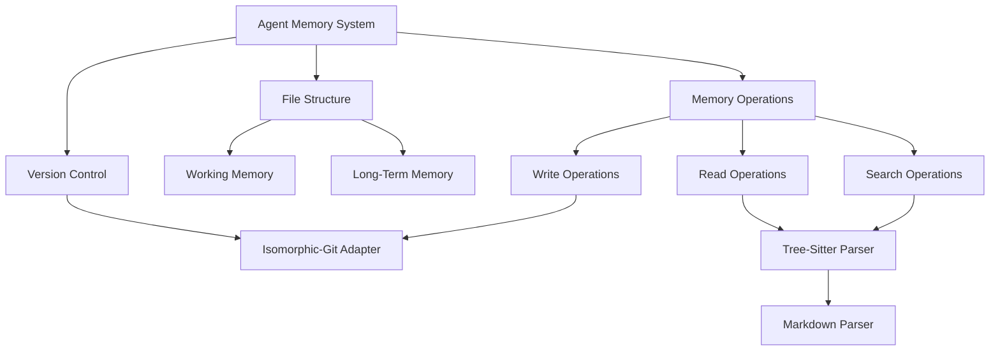
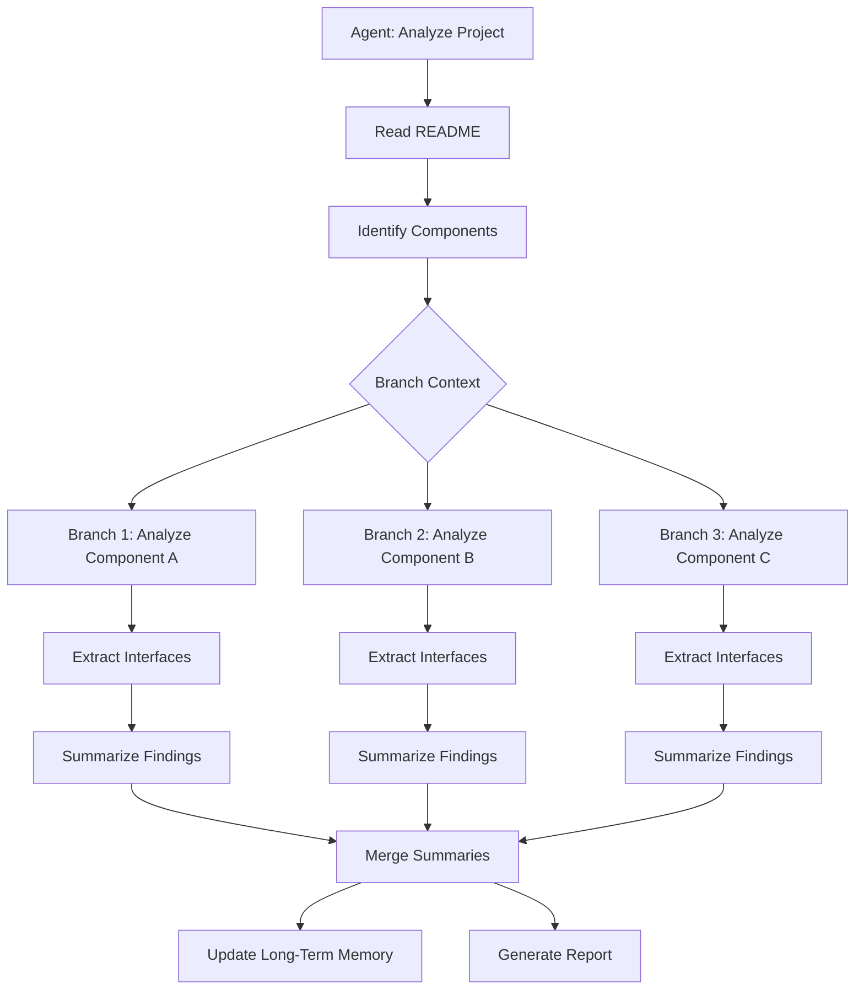

# Agent Memory

```mermaid
graph TD
    A[Agent Memory System] --> B[File Structure]
    A --> C[Memory Operations]
    A --> D[Version Control]
    
    B --> B1[Working Memory]
    B --> B2[Long-Term Memory]
    
    C --> C1[Read Operations]
    C --> C2[Write Operations]
    C --> C3[Search Operations]
    
    D --> D1[Isomorphic-Git Adapter]
    
    C1 --> E1[Tree-Sitter Parser]
    C3 --> E1
    
    E1 --> F1[Markdown Parser]
    
    C2 --> D1
```
# Context Branching

```mermaid
graph TD
    A[Agent: Analyze Project] --> B[Read README]
    B --> C[Identify Components]
    C --> D{Branch Context}
    
    D --> E1[Branch 1: Analyze Component A]
    D --> E2[Branch 2: Analyze Component B]
    D --> E3[Branch 3: Analyze Component C]
    
    E1 --> F1[Extract Interfaces]
    E2 --> F2[Extract Interfaces]
    E3 --> F3[Extract Interfaces]
    
    F1 --> G1[Summarize Findings]
    F2 --> G2[Summarize Findings]
    F3 --> G3[Summarize Findings]
    
    G1 --> H[Merge Summaries]
    G2 --> H
    G3 --> H
    
    H --> I[Update Long-Term Memory]
    H --> J[Generate Report]
```